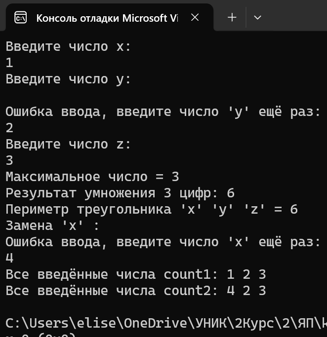
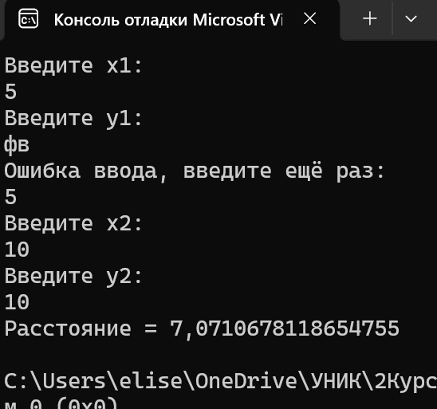

# Мартелов Елисей Группа ИТС1 Лабораторная №6

## Задание 1

### Задача 1

### Текст задачи

#### Разработать класс с тремя целочисленными полями. Создать конструктор копирования. Разработать метод, вычисляющий максимальное из полей. Перегрузить метод ToString() для формирования строки из полей класса. Реализовать дочерний класс (его содержание предложить самостоятельно и описать в решении: какой содержательный смысл имеют поля; реализовать конструкторы; предложить и реализовать 2-3 метода). Протестировать все конструкторы и другие методы базового и дочернего классов

### Алгоритм решения

#### В Main создаются переменные x, y, z. К ним присваиваются значения через цикл while и int.TryParse (нужно для проверки ввода цифр), тут же если введена не цифра, цикл пойдёт сначала и запросит повторно ввести число. В "MAX count1 = new MAX(x,y,z)" происходит инициализация объекта с введёнными только что цифрами "MAX count1 = new MAX(x, y, z);". После происходит копирование count1 в count2 "MAX count2 = new MAX(count1)". Далее происходит вызов метода объекта "GetMAX()" (в нём происходит поиск максимального числа), далее вывод максимального числа. И используя дочерний класс выводит результат умножения 3 цифр и периметр треугольника. Содержательный смысл в подсчёте произведения и периметра треугольника.

#### В классе MAX создаются защищённые числовые поля x, y, z, конструктор с параметрами "public MAX(int x,int y,int z)" и передаёт ему цифры из Main присваивая их к полям "this.x = x" итд. Далее копирование, передаётся объект класса и его поля записываются в текущие поля. В свойстве X происходит чтение(отдаёт числа наружу) и запись нового значения(сохраняет новое число в поле). После описывается метод получения максимума используя математическую функция "Math". В самом конце происходит перегруз метода ToString()

#### В дочернем классе DotMAX происходит наследование из класса MAX "class DotMAX : MAX". Далее в DotMAX(тут дочерний класс принимает аргументы и передаёт в конструктор базовго класса) : base(x,y,z)(то есть создаёт дочерний класс DotMAX на базе родительского MAX). В GetYmn() происходит возврат произведения "return x\*y\*z;" , В GetP() происходит возврат периметра треугольника "return x+y+z;".

### Тестирование

## Задание 2

### Задача 1

### Текст задачи

#### Вычислить расстояние от одной точки до другой. Результат должен быть типа double

### Алгоритм решения

#### Реализация ввода такая же как и в первой задаче с проверкой ввода TryParse, но переменные теперь double. Объявляю создание точек Point p2 с значениями x1, y1 и такую же Point p2 с значениями x2, y2 "Point p1 = new Point(x1, y1);"

#### В классе Point создаются: конструктор, копирование, свойства, методы - так же как в задании 1 только double, так как используются дробные числа. Расчёт расстояния происходит в "GetDistance" с помощью математической формулы (квадратный корень из суммы квадратов разностей координат x и y) , он берёт текущую точку this и точку переданную в качестве аргумента.

### Тестирование

